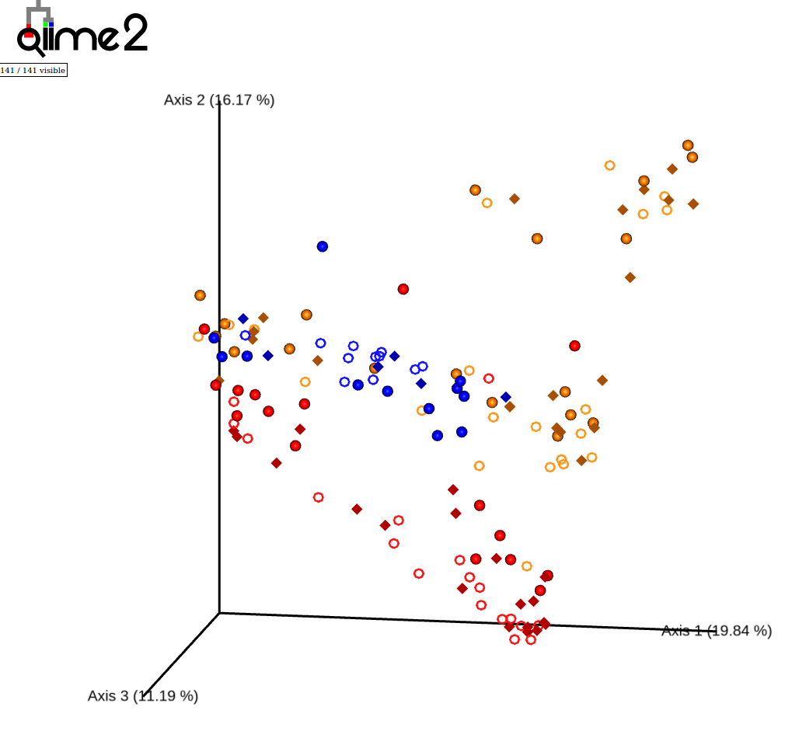

# Metagenomics with QIIME 2

# Introduction

In this tutorial, we will reproduce the results from [Nuzzo et. al (2021)](https://bmcmicrobiol.biomedcentral.com/articles/10.1186/s12866-021-02245-8) using QIIME 2 to analyze longitudinal changes in microbial composition of adult females with uncomplicated urinary tract infections (uUTI) before and after treatment with the oral antibiotic Gepotidacin, which was in phase 2A clinical trials. Their study was motivated by an increasing appreciation for the potential negative impacts oral antibiotics have on patients’ microbiomes. Therefore, in the course of antibiotic drug development it is desirable to quantify the impact drug candidates have on the microbiome. By the end of this tutorial, you will have determined what effect Gepotidacin has on patients’ microbiomes and learned to use several fundamental tools in metagenomic analyses with QIIME 2 along the way!

## **Cohort description**

Female patients with recurrent uUTI were administered Gepotidacin for 5 days. Samples were collected with pharyngeal swabs, vaginal swabs and stool sampling at first day of dosing (Day 1), at the end of regimen (Day 5) and at a follow-up visit happening 28±3 days after Day 1.

| Body site | Day 1 |  | Day 5 |  | Follow-up |  | Total Collected | Total Pass QC |
| --- | --- | --- | --- | --- | --- | --- | --- | --- |
|  | Collected | Passed QC | Collected | Passed QC | Collected | Passed QC |  |  |
| GI Tract (stool) | 13 | 11 | 13 | 12 | 10 | 6 | 36 | 29 |
| Pharyngeal (saliva) | 21 | 18 | 20 | 16 | 19 | 19 | 60 | 53 |
| Vaginal (swabs) | 21 | 21 | 20 | 19 | 19 | 19 | 60 | 59 |
| Total | 55 | 50 | 53 | 47 | 48 | 44 | 156 | 141 |

## 16S rRNA Gene Sequencing

Nuzzo et al. used 16s rRNA V4 gene sequencing from their clinical trial patients to quantify their microbiomes. 16S rRNA gene sequencing is one of the most attractive methods for identifying microbial species present in diverse communities because, as the name implies, it enriches for the 16S rRNA gene before sequencing. Sequencing the 16S rRNA gene is particularly useful microbiome quantification because it has both ~8 highly conserved regions that enable efficient targeting for PCR amplification and ~9 variable regions across the bacteria domain that enable taxonomy classification.


The variable regions allow us to associate reads with different microbial species and therefore compute the relative abundances of species in a sample.

# Before You Begin

Complete Step 0 and ensure you can successfully activate QIIME 2 on your computer. Steps 1-4a are computationally demanding and have been executed for you; their outputs are provided in the tutorial’s GitHub repository.

## Step 0: Install QIIME 2 & Clone Tutorial (Data)

Install QIIME 2 as a conda environment named `qiime2-2022.2`. Choose the instructions that match your operating system.

- **Mac**
    
    ```bash
    wget https://data.qiime2.org/distro/core/qiime2-2022.2-py38-osx-conda.yml
    conda env create -n qiime2-2022.2 --file qiime2-2022.2-py38-osx-conda.yml
    # OPTIONAL CLEANUP
    rm qiime2-2022.2-py38-osx-conda.yml
    ```
    
- **Linux**
    
    ```bash
    wget https://data.qiime2.org/distro/core/qiime2-2022.2-py38-linux-conda.yml
    conda env create -n qiime2-2022.2 --file qiime2-2022.2-py38-linux-conda.yml
    # OPTIONAL CLEANUP
    rm qiime2-2022.2-py38-linux-conda.yml
    ```
    
- **Windows (WSL)**
    
    You should skip any step that you have done prior.
    
    1. [Install WSL](https://docs.microsoft.com/en-us/windows/wsl/install)
    2. [Install `miniconda`](https://docs.conda.io/en/latest/miniconda.html)
    3. Install Qiime2
    
    ```bash
    wget https://data.qiime2.org/distro/core/qiime2-2022.2-py38-linux-conda.yml
    conda create -n qiime2-2022.2
    conda env update -n qiime2-2022.2 -f qiime2-2022.2-py38-linux-conda.yml
    # OPTIONAL CLEANUP
    rm qiime2-2022.2-py38-linux-conda.yml
    ```
    
    Note: If you run into issues installing Qiime2 (as we did), try reinstalling conda (backup your environments first!) and installing Qiime2 again.
    

After installing QIIME 2, confirm that the installation was successful by activating your new environment and checking that `qiime` runs.

```bash
conda activate qiime2-2022.2
qiime
```

Then, clone the GitHub repository for the tutorial.

```bash
git clone https://github.com/d-laub/med263_wi22_metagenomics_tutorial.git
```

# Pre-Computed Steps

## Step 1: Import

The first thing we do is call `qiime tools import` which imports 16S FASTQ reads from the sequencing experiment into QIIME 2 and generates a `.qza` file, short for QIIME Zipped Artifact.

```bash
# Import Data as a QIIME 2 artifact
qiime tools import \
  --type 'SampleData[PairedEndSequencesWithQuality]' \ # We have paired end reads with quality scores
  --input-path raw_data \ # Folder containing all raw data
  --input-format PairedEndFastqManifestPhred64V2 \ # Specifically, PHRED 64 quality scores
  --output-path demux.qza
```

Next we use `qiime demux summarize` to generate a QIIME Zipped Visualization (`.qzv`) file from the QZA file. 

```bash
qiime demux summarize \
  --i-data demux.qza \
  --o-visualization demux.qzv
```

The QZV file provides a summary and sometimes statistics for the data in the QZA that we can then view:

```bash
qiime tools view demux.qzv
```

When given a demux QZV, this command will open a browser window with visualizations characterizing the samples and sequencing quality.

**Note** **if you are using WSL:** you cannot readily use `qiime tools view`, but you can upload any `.qvz` file to [view.qiime2.org](http://view.qiime2.org) instead.

## Step 2: Denoise

Next we use `qiime dada2 denoise-paired` to filter paired-end sequences based on quality, merge dereplicates, and remove chimeric reads with DADA2.

```bash
# Executing DADA2 dereplication
qiime dada2 denoise-paired \
  --i-demultiplexed-seqs demux.qza \ # Input demultiplexed reads
  --p-n-threads 8 \ # Use 8 threads
  --p-trunc-len-f 150 \ # Sets trim length for forward reads
  --p-trunc-len-r 149 \ # Sets trim length for reverse reads
  --o-table table.qza \ # Counts table
  --o-denoising-stats stats.qza \ # Statistics from DADA2 (number of reads passing filtering, etc.)
  --o-representative-sequences rep-seqs.qza # Assigned OTU names and corresponding DNA sequences
```

This will denoise our sample reads and generate three artifacts:

1. An **amplicon sequence variant** (ASV) counts table `table.qza` quantifying how many of each ASV was observed.
2. A representative sequence table `rep-seqs.qza` that contains all the unique ASVs observed, each corresponding to a count in `table.qza`.
3. A summary of sample data and statistics `stats.qza` containing informative metrics about the denoising process.

<aside>
    ❓ <b>What is an amplicon sequence variant (ASV)?</b>
Simply put, ASVs are DNA <em>sequences</em>. However, the name refers to that these sequences are identified by denoising PCR <em>amplicon</em> reads and that they <em>vary</em> across samples and/or species.

</aside>

## Step 3: Assigning Taxonomy

We will explore the bacterial taxonomic composition of the samples and relate that to our sample metadata.

Note: This script assumes you have Silva v.138 pre-trained classifier downloaded in the selected folder. This classifier is supplied on the Github.

```bash
echo -e "Assign taxonomy against SILVA 138 pretrained V4"
qiime feature-classifier classify-sklearn \
  --i-reads rep-seqs.qza \
  --i-classifier databases/silva-138-99-515-806-nb-classifier.qza \
  --o-classification taxonomy.qza
```

`qiime feature-classifier classify-sklearn`

This command will assign the taxonomy to the sequence in the artifact by using a pre-trained naïve Bayes classifier from the QIIME 2 website. Users can also follow the instructions on the QIIME 2 website to train their own classifier with their own reference database and sequencing parameters.

```bash
qiime metadata tabulate \
  --m-input-file taxonomy.qza \
  --o-visualization taxonomy.qzv 
```

`qiime metadata tabulate`

This command will create a taxonomic table for visualization.

## Step 4a: Filtering Data

We will filter the data by removing Singletons, Mitochondria, and Chloroplast. After filtering the data, we will build the phylogenetic tree.

```bash
echo -e "#Remove Singletons"
qiime feature-table filter-features \
  --i-table table.qza \
  --p-min-frequency 2 \
  --o-filtered-table feature-frequency-filtered-table.qza

qiime feature-table filter-seqs \
  --i-data rep-seqs.qza \
  --i-table feature-frequency-filtered-table.qza \
  --p-no-exclude-ids \
  --o-filtered-data feature-frequency-filtered-rep-seqs.qza
```

`qiime feature-table filter-features`

This command will remove features with low abundance from the feature table by filtering all features with a total abundance of less than 2.

`qiime feature-table filter-seqs`

This command will remove all sequences from the `rep-seqs.qza` file that do not have a matching ID in the filtered table. 

```bash
# Remove Mitochondria and Chloroplast
qiime taxa filter-table \
  --i-table feature-frequency-filtered-table.qza \
  --i-taxonomy taxonomy.qza \
  --p-exclude mitochondria,chloroplast \
  --o-filtered-table table_no_mit_chlo.qza

qiime feature-table filter-samples \
  --i-table table_no_mit_chlo.qza \
  --p-min-frequency 9500 \
  --o-filtered-table table_filtered.qza

qiime taxa filter-seqs \
  --i-sequences feature-frequency-filtered-rep-seqs.qza \
  --i-taxonomy taxonomy.qza \
  --p-exclude mitochondria,chloroplast \
  --o-filtered-sequences rep-seqs_filtered.qza
```

`qiime taxa filter-table`

This command will remove features that contain mitochondria and chloroplast in the taxonomic annotation.

`qiime feature-table filter samples`

This command will exclude samples that have fewer than 9500 reads. Removing samples with significantly fewer reads than the majority of samples is recommended in sequencing analysis. 

`qiime taxa filter-seq`

This command will filter sequences to remove features that contain mitochondria and chloroplast in the taxonomic annotation.

# Hands-on Steps

### Step 4b: Building phylogenetic tree

```bash
### START HERE FOR TUTORIAL
# Using QIIME 2 v2022.2. Activate qiime environment if not already activated.
conda activate qiime2-2022.2

# Build phylogenetic tree from rep-seqs_filtered.qza
qiime phylogeny align-to-tree-mafft-fasttree \
  --i-sequences rep-seqs_filtered.qza \
  --o-alignment aligned-rep-seqs.qza \
  --o-masked-alignment masked-aligned-rep-seqs.qza \
  --o-tree unrooted-tree.qza \
  --o-rooted-tree rooted-tree.qza
```

`qiime phylogeny align-to-tree-mafft-fasttree`

This command generates a phylogenetic tree from the sequences in this study. This tree is required for certain community diversity analyses in Step 5. 

### Step 5: Alpha- and Beta-diversity analyses

Microbiome research uses ecological diversity metrics to describe microbial communities. Alpha-diversity metrics assess the diversity profile of an individual sample; the output is one numeric value per sample that indicates the level of diversity within the sample. Beta-diversity metrics assess the dissimilarity between samples; the output is a distance matrix that provides the distance between all sample pairs within the experiment. 

The command below calculates common alpha- and beta-diversity metrics for the samples provided in the table. An important parameter to set is the sampling depth, which is determined by the researcher after looking at the number of reads in each sample (these can be found by viewing the `table_filtered.qzv`). Samples with fewer reads than the sampling depth will be dropped from the analysis. We want to pick a sampling depth that is “as high as possible, while excluding as few samples as possible” (from QIIME 2 Moving Pictures tutorial). In this case, samples with low read counts have already been excluded. We can use the same value used in Step 4 for `--p-min-frequency`.

```bash
qiime diversity core-metrics-phylogenetic \
  --i-phylogeny rooted-tree.qza \
  --i-table table_filtered.qza \
  --p-sampling-depth 9500 \
  --m-metadata-file metadata.txt \
  --output-dir core-metrics-results

cd core-metrics-results
```

The above command creates a new directory called core-metrics-results and outputs files related to 3 alpha-diversity metrics and 4 beta-diversity metrics. The output for alpha-diversity metrics is a `_vector.qza` file, which contains the calculated alpha-diversity value for each sample. The output for beta-diversity metrics is a `_distance_matrix.qza`, `_pcoa_results.qza`, and `_emperor.qzv` file. The `_emperor.qzv` file is a 3-dimensional PCA plot generated from the corresponding distance matrix. It can be viewed like any other QZV file.

Note: if you are using WSL you cannot readily use `qiime tools view`, but you can upload any `.qvz` file to [view.qiime2.org](http://view.qiime2.org) instead.

```bash
qiime tools view unweighted_unifrac_emperor.qzv
```



Unweighted UniFrac PCA plot. Sample color indicates type (saliva, stool, vaginal). Sample shape indicates time (predose, day 5, followup visit). Plot background has been changed to white and plot axes have been changed to black (default is opposite).

Note: you may have a slightly different arrangement of points and % variances in your PCs. This is due to stochasticity of the algorithm for phylogenetic tree inference in step 4b.

We can also test for statistically significant differences in diversity values between the groups. 

```bash
# Test for significant differences between groups for Faith's PD metric
qiime diversity alpha-group-significance \
  --i-alpha-diversity faith_pd_vector.qza \
  --m-metadata-file ../metadata.txt \
  --o-visualization faith-pd-group-significance.qzv
qiime tools view faith-pd-group-significance.qzv

# Test for signficant differences between groups for Unweighted UniFrac metric. 
qiime diversity beta-group-significance \
  --i-distance-matrix unweighted_unifrac_distance_matrix.qza \
  --m-metadata-file ../metadata.txt \
  --m-metadata-column dummy \
  --o-visualization unweighted_unifrac-dummy-significance.qzv \
  --p-pairwise
qiime tools view unweighted_unifrac-dummy-significance.qzv
```


Boxplot from faith-pd-group-significance.qzv. This plot shows the Faith’s PD values for the “dummy” column of the metadata.txt file. The “dummy” column divides samples into groups based on sample type and collection time. Below this plot in the visualization are the p-values for differences between groups. The metadata column of interest can be changed using the “Column” dropdown menu above the plot. 

## **Step 6: Taxonomic Analysis**

We often want to know which microbial taxa are present in our samples. The provided `taxonomy.qza` file contains a taxonomic identification for each sequence present in the `table.qza` file. These identities were assigned by comparing the sequences to the SILVA 138 99% OTUs reference database of 16S sequences, constrained by the primers used for this sequencing experiment. We will use the `taxonomy.qza` file to generate taxonomy bar plots for this study.

```bash
cd .. # Navigate out of core-metrics-results directory, back to main directory
 
qiime taxa barplot \
  --i-table table_filtered.qza \
  --i-taxonomy taxonomy.qza \
  --m-metadata-file metadata.txt \
  --o-visualization taxa-bar-plots.qzv
qiime tools view taxa-bar-plots.qzv
```

Explore the QZV file. We can view different taxonomic levels (kingdom, phylum, class, etc.) by selecting the “Taxonomic level” dropdown at the top. We can also rearrange the order of samples on the x-axis by sorting on different metadata columns. The figure itself can be downloaded as an SVG file (compatible with Illustrator, Inkscape, etc.) or the data can be downloaded as a CSV file containing a counts table.
